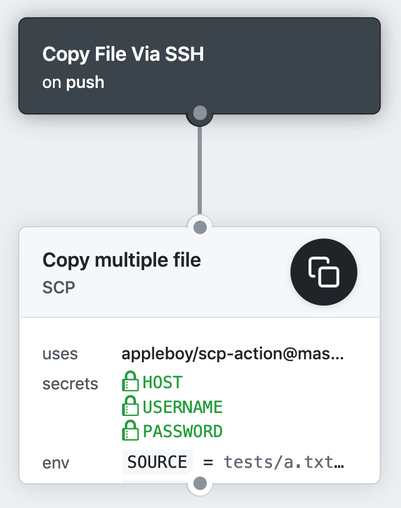

# 🚀 SCP for GitHub Actions

[GitHub Action](https://github.com/features/actions) for copying files and artifacts via SSH.



[](https://github.com/appleboy/scp-action/actions)

## Usage

copy files and artifacts via SSH as blow.

```yaml
name: scp files
on: [push]
jobs:

  build:
    name: Build
    runs-on: ubuntu-latest
    steps:
    - uses: actions/checkout@master
    - name: copy file via ssh password
      uses: appleboy/scp-action@master
      with:
        host: ${{ secrets.HOST }}
        username: ${{ secrets.USERNAME }}
        password: ${{ secrets.PASSWORD }}
        port: ${{ secrets.PORT }}
        source: "tests/a.txt,tests/b.txt"
        target: "test"
```

## Input variables

see the [action.yml](./action.yml) file for more detail imformation.

* host - scp remote host
* port - scp remote port, default is `22`
* username - scp username
* password - scp password
* passphrase - the passphrase is usually to encrypt the private key
* timeout - timeout for ssh to remote host, default is `30s`
* command_timeout - timeout for scp command, default is `10m`
* key - content of ssh private key. ex raw content of ~/.ssh/id_rsa
* key_path - path of ssh private key
* target - target path on the server
* source - scp file list
* rm - remove target folder before upload data
* strip_components - remove the specified number of leading path elements.
* overwrite - use `--overwrite` flag with tar
* tar_tmp_path - temporary path for tar file on the dest host

SSH Proxy Setting:

* proxy_host - proxy host
* proxy_port - proxy port, default is `22`
* proxy_username - proxy username
* proxy_password - proxy password
* proxy_passphrase - the passphrase is usually to encrypt the private key
* proxy_timeout - timeout for ssh to proxy host, default is `30s`
* proxy_key - content of ssh proxy private key.
* proxy_key_path - path of ssh proxy private key

### Example

Copy file via ssh password

```yaml
- name: copy file via ssh password
  uses: appleboy/scp-action@master
  with:
    host: example.com
    username: foo
    password: bar
    port: 22
    source: "tests/a.txt,tests/b.txt"
    target: "test"
```

Copy file via ssh key

```yaml
- name: copy file via ssh key
  uses: appleboy/scp-action@master
  env:
    HOST: ${{ secrets.HOST }}
    USERNAME: ${{ secrets.USERNAME }}
    PORT: ${{ secrets.PORT }}
    KEY: ${{ secrets.KEY }}
  with:
    source: "tests/a.txt,tests/b.txt"
    target: "test"
```

Example configuration for ignore list:

```yaml
- name: copy file via ssh key
  uses: appleboy/scp-action@master
  env:
    HOST: ${{ secrets.HOST }}
    USERNAME: ${{ secrets.USERNAME }}
    PORT: ${{ secrets.PORT }}
    KEY: ${{ secrets.KEY }}
  with:
    source: "tests/*.txt,!tests/a.txt"
    target: "test"
```

Example configuration for multiple server

```diff
  uses: appleboy/scp-action@master
  with:
-   host: "example.com"
+   host: "foo.com,bar.com"
    username: foo
    password: bar
    port: 22
    source: "tests/a.txt,tests/b.txt"
    target: "test"
```

remove the specified number of leading path elements

```yaml
- name: remove the specified number of leading path elements
  uses: appleboy/scp-action@master
  with:
    host: ${{ secrets.HOST }}
    username: ${{ secrets.USERNAME }}
    key: ${{ secrets.KEY }}
    port: ${{ secrets.PORT }}
    source: "tests/a.txt,tests/b.txt"
    target: "foobar"
    strip_components: 1
```

old target structure:

```sh
foobar
  └── tests
    ├── a.txt
    └── b.txt
```

new target structure:

```sh
foobar
  ├── a.txt
  └── b.txt
```

Protecting a Private Key. The purpose of the passphrase is usually to encrypt the private key. This makes the key file by itself useless to an attacker. It is not uncommon for files to leak from backups or decommissioned hardware, and hackers commonly exfiltrate files from compromised systems.

```diff
  - name: ssh key with passphrase
    uses: appleboy/scp-action@master
    with:
      host: ${{ secrets.HOST }}
      username: ${{ secrets.USERNAME }}
      key: ${{ secrets.SSH2 }}
+     passphrase: ${{ secrets.PASSPHRASE }}
      port: ${{ secrets.PORT }}
      source: "tests/a.txt,tests/b.txt"
      target: "test"
```
