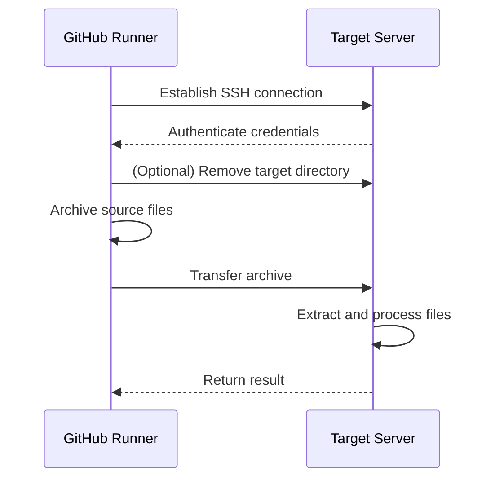

# 🚀 SCP for GitHub Actions

[繁體中文](README.zh-tw.md) | [简体中文](README.zh-cn.md)

[GitHub Action](https://github.com/features/actions) for copying files and artifacts via SSH.

[](https://github.com/appleboy/scp-action/actions)

> **Note:** Only supports **Linux** [docker](https://www.docker.com/) containers.

---

## ✨ Features

- ✅ Copy files and artifacts to one or multiple remote servers via SSH
- ✅ Supports both SSH key and password authentication
- ✅ Full SSH Proxy (jump host) support
- ✅ Handles Linux ↔ Windows path conversion
- ✅ Integrates with GitHub Artifacts workflow
- ✅ Incremental and differential file transfer
- ✅ Rich configuration options for advanced use cases

---

## 📦 Table of Contents

- [🚀 SCP for GitHub Actions](#-scp-for-github-actions)
  - [✨ Features](#-features)
  - [📦 Table of Contents](#-table-of-contents)
  - [🚀 Quick Start](#-quick-start)
  - [⚙️ Configuration](#️-configuration)
    - [🔌 Connection Settings](#-connection-settings)
    - [📁 File Transfer Settings](#-file-transfer-settings)
    - [🌐 Proxy Settings](#-proxy-settings)
  - [🛡️ Best Practices \& Security](#️-best-practices--security)
  - [🖥️ Cross-Platform Notes](#️-cross-platform-notes)
  - [💡 Usage Examples](#-usage-examples)
    - [🧩 Scenario Guide](#-scenario-guide)
      - [Example 1: Basic SSH Password](#example-1-basic-ssh-password)
      - [Example 2: Multi-server](#example-2-multi-server)
      - [Example 3: Changed Files Only](#example-3-changed-files-only)
      - [Example 4: Artifacts Integration](#example-4-artifacts-integration)
      - [Example 5: Windows Server](#example-5-windows-server)
  - [🗝️ SSH Key Setup](#️-ssh-key-setup)
  - [🧰 Common Error Codes](#-common-error-codes)
  - [🔄 Workflow Diagram](#-workflow-diagram)
  - [FAQ \& Troubleshooting](#faq--troubleshooting)
  - [📝 License](#-license)

---

## 🚀 Quick Start

Copy files and artifacts via SSH in your GitHub Actions workflow:

```yaml
name: scp files
on: [push]
jobs:
  build:
    runs-on: ubuntu-latest
    steps:
      - uses: actions/checkout@v4
      - name: Copy files via SSH
        uses: appleboy/scp-action@v0.1.7
        with:
          host: ${{ secrets.HOST }}
          username: ${{ secrets.USERNAME }}
          password: ${{ secrets.PASSWORD }}
          port: ${{ secrets.PORT }}
          source: "tests/a.txt,tests/b.txt"
          target: your_server_target_folder_path
```

---

## ⚙️ Configuration

### 🔌 Connection Settings

| Variable        | Description                                  | Default | Required |
| --------------- | -------------------------------------------- | ------- | -------- |
| host            | Remote host(s), comma-separated for multiple | -       | ✓        |
| port            | SSH port                                     | 22      |          |
| username        | SSH username                                 | -       | ✓        |
| password        | SSH password (prefer SSH key for security)   | -       |          |
| key             | SSH private key content                      | -       |          |
| key_path        | Path to SSH private key file                 | -       |          |
| passphrase      | Passphrase for SSH private key               | -       |          |
| fingerprint     | SHA256 fingerprint for host key verification | -       |          |
| protocol        | IP protocol: 'tcp', 'tcp4', or 'tcp6'        | tcp     |          |
| timeout         | SSH connection timeout                       | 30s     |          |
| command_timeout | SCP command timeout                          | 10m     |          |

### 📁 File Transfer Settings

| Variable         | Description                                             | Default | Security Note          |
| ---------------- | ------------------------------------------------------- | ------- | ---------------------- |
| source           | Local files/directories to transfer (comma-separated)   | -       | Use explicit paths     |
| target           | Target directory on remote server (must be a directory) | -       | Avoid root directories |
| rm               | Remove target directory before upload                   | -       | Use with caution       |
| strip_components | Remove leading path elements when extracting            | -       |                        |
| overwrite        | Overwrite existing files with tar                       | -       |                        |
| tar_dereference  | Follow symlinks with tar                                | -       |                        |
| tar_tmp_path     | Temp path for tar file on destination                   | -       |                        |
| tar_exec         | Path to tar executable on destination                   | tar     |                        |
| debug            | Enable debug output                                     | -       |                        |
| curl_insecure    | Use --insecure with curl                                | false   | Not recommended        |
| capture_stdout   | Capture command stdout as action output                 | false   |                        |
| version          | Version of drone-scp to use                             | -       |                        |

### 🌐 Proxy Settings

| Variable                  | Description                          | Default | Required |
| ------------------------- | ------------------------------------ | ------- | -------- |
| proxy_host                | SSH proxy host                       | -       |          |
| proxy_port                | SSH proxy port                       | 22      |          |
| proxy_username            | SSH proxy username                   | -       |          |
| proxy_password            | SSH proxy password                   | -       |          |
| proxy_key                 | SSH proxy private key content        | -       |          |
| proxy_key_path            | Path to SSH proxy private key file   | -       |          |
| proxy_passphrase          | Passphrase for SSH proxy private key | -       |          |
| proxy_fingerprint         | SHA256 fingerprint for proxy host    | -       |          |
| proxy_use_insecure_cipher | Enable less secure ciphers for proxy | -       |          |
| proxy_timeout             | SSH proxy connection timeout         | 30s     |          |

---

## 🛡️ Best Practices & Security

- **Prefer SSH key authentication** over passwords for better security.
- Store all sensitive values (host, username, password, key) in **GitHub Secrets**.
- Regularly **rotate deployment keys** (suggested every 90 days).
- Restrict write permissions on the target server directory.
- Enable host key fingerprint verification to prevent MITM attacks.
- Avoid using root as the SSH user.

---

## 🖥️ Cross-Platform Notes

| Scenario         | Linux Server   | Windows Server          |
| ---------------- | -------------- | ----------------------- |
| Path Format      | `/path/to/dir` | `/c/path/to/dir`        |
| Required Setting | None           | `tar_dereference: true` |
| Permissions      | Preserved      | May require manual ACL  |
| Shell            | bash (default) | Git Bash via OpenSSH    |

> 🚩 **Important:**  
> When copying to Windows servers:
>
> - Install Git for Windows and set OpenSSH default shell to Git Bash
> - Use Unix-style target paths (e.g., `/c/Users/...`)
> - Enable `tar_dereference` for symlink handling

---

## 💡 Usage Examples

### 🧩 Scenario Guide

- **Basic file transfer** → [Example 1](#example-1-basic-ssh-password)
- **Multi-server deployment** → [Example 2](#example-2-multi-server)
- **Incremental/changed files only** → [Example 3](#example-3-changed-files-only)
- **Artifacts integration** → [Example 4](#example-4-artifacts-integration)
- **Windows server setup** → [Example 5](#example-5-windows-server)

---

#### Example 1: Basic SSH Password

```yaml
- name: Copy file via SSH password
  uses: appleboy/scp-action@v0.1.7
  with:
    host: example.com
    username: foo
    password: bar
    port: 22
    source: "tests/a.txt,tests/b.txt"
    target: your_server_target_folder_path
```

#### Example 2: Multi-server

```yaml
- name: Copy to multiple servers
  uses: appleboy/scp-action@v0.1.7
  with:
    host: "foo.com,bar.com"
    username: foo
    password: bar
    port: 22
    source: "tests/a.txt,tests/b.txt"
    target: your_server_target_folder_path
```

#### Example 3: Changed Files Only

```yaml
- name: Get changed files
  id: changed-files
  uses: tj-actions/changed-files@v35
  with:
    since_last_remote_commit: true
    separator: ","

- name: Copy changed files to server
  uses: appleboy/scp-action@v0.1.7
  with:
    host: ${{ secrets.HOST }}
    username: ${{ secrets.USERNAME }}
    key: ${{ secrets.KEY }}
    port: ${{ secrets.PORT }}
    source: ${{ steps.changed-files.outputs.all_changed_files }}
    target: your_server_target_folder_path
```

#### Example 4: Artifacts Integration

```yaml
- uses: actions/upload-artifact@v4
  with:
    name: my-artifact
    path: world.txt

- uses: actions/download-artifact@v4
  with:
    name: my-artifact
    path: distfiles

- name: Copy artifact to server
  uses: appleboy/scp-action@v0.1.7
  with:
    host: ${{ secrets.HOST }}
    username: ${{ secrets.USERNAME }}
    key: ${{ secrets.KEY }}
    port: ${{ secrets.PORT }}
    source: distfiles/*
    target: your_server_target_folder_path
```

#### Example 5: Windows Server

```yaml
- name: Copy to Windows
  uses: appleboy/scp-action@v0.1.7
  with:
    host: ${{ secrets.HOST }}
    username: ${{ secrets.USERNAME }}
    key: ${{ secrets.SSH_PRIVATE_KEY }}
    port: 22
    source: "your_source_path"
    target: "/c/path/to/target/"
    tar_dereference: true
    rm: true
```

---

## 🗝️ SSH Key Setup

1. **Generate SSH Key** (on your local machine):

   ```bash
   # RSA
   ssh-keygen -t rsa -b 4096 -C "your_email@example.com"
   # ED25519
   ssh-keygen -t ed25519 -a 200 -C "your_email@example.com"
   ```

2. **Add Public Key to Server**:

   ```bash
   cat .ssh/id_rsa.pub | ssh user@host 'cat >> .ssh/authorized_keys'
   # or for ed25519
   cat .ssh/id_ed25519.pub | ssh user@host 'cat >> .ssh/authorized_keys'
   ```

3. **Copy Private Key Content to GitHub Secrets**:

   ```bash
   clip < ~/.ssh/id_rsa
   # or
   clip < ~/.ssh/id_ed25519
   ```

> See [SSH login without password](http://www.linuxproblem.org/art_9.html) for more details.

**OpenSSH Note:**  
If you see `ssh: handshake failed: ssh: unable to authenticate, attempted methods [none publickey]`, ensure your key algorithm is supported.  
On Ubuntu 20.04+, add to `/etc/ssh/sshd_config` or `/etc/ssh/sshd_config.d/`:

```sh
CASignatureAlgorithms +ssh-rsa
```

Or use ed25519 keys, which are accepted by default.

---

## 🧰 Common Error Codes

| Error Code     | Possible Cause               | Solution                                      |
| -------------- | ---------------------------- | --------------------------------------------- |
| `ECONNREFUSED` | Wrong port / firewall blocks | Check port and firewall settings              |
| `ENOENT`       | Source file not found        | Use absolute path or check checkout step      |
| `EAUTH`        | Authentication failed        | Check key format and permissions (PEM format) |

---

## 🔄 Workflow Diagram



---

## FAQ & Troubleshooting

- **Q: Why does authentication fail?**  
  A: Check SSH key format, permissions, and that the key is added to the server.

- **Q: How do I copy only changed files?**  
  A: Use `tj-actions/changed-files` to get changed files and pass to `source`.

- **Q: How to deploy to multiple servers?**  
  A: Use comma-separated host list: `host: "foo.com,bar.com"`

- **Q: How to copy to Windows?**  
  A: Set up Git Bash, use Unix-style paths, and enable `tar_dereference`.

---

## 📝 License

MIT License
