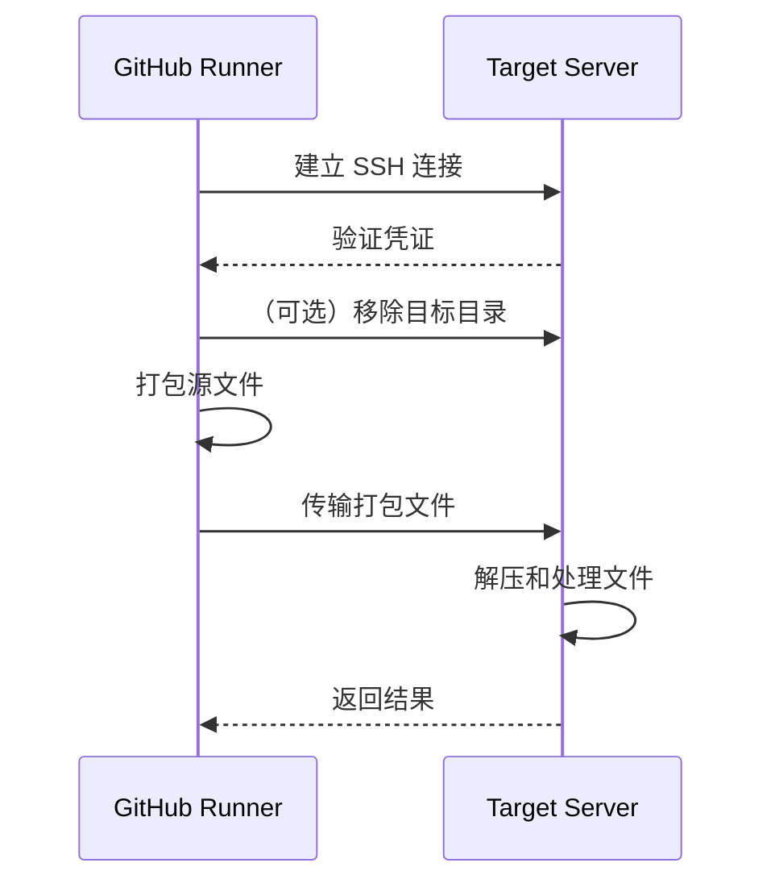

# 🚀 GitHub Actions 的 SCP

[English](README.md) | [繁體中文](README.zh-tw.md)

[GitHub Action](https://github.com/features/actions) 用于通过 SSH 复制文件和构建产物。

[](https://github.com/appleboy/scp-action/actions/workflows/testing.yml)

> **注意：** 仅支持 **Linux** [docker](https://www.docker.com/) 容器。

---

## ✨ 功能特性

- ✅ 通过 SSH 将文件和产物复制到一台或多台远程服务器
- ✅ 支持 SSH 密钥和密码认证
- ✅ 完全支持 SSH 代理（跳板机）
- ✅ 处理 Linux ↔ Windows 路径转换
- ✅ 集成 GitHub Artifacts 工作流
- ✅ 支持增量与差异文件传输
- ✅ 丰富的高级配置选项

---

## 📦 目录

- [🚀 GitHub Actions 的 SCP](#-github-actions-的-scp)
  - [✨ 功能特性](#-功能特性)
  - [📦 目录](#-目录)
  - [🚀 快速开始](#-快速开始)
  - [⚙️ 配置说明](#️-配置说明)
    - [🔌 连接设置](#-连接设置)
    - [📁 文件传输设置](#-文件传输设置)
    - [🌐 代理设置](#-代理设置)
  - [🛡️ 最佳实践与安全性](#️-最佳实践与安全性)
  - [🖥️ 跨平台注意事项](#️-跨平台注意事项)
  - [💡 使用示例](#-使用示例)
    - [🧩 场景导览](#-场景导览)
      - [示例 1：基本 SSH 密码](#示例-1基本-ssh-密码)
      - [示例 2：多台服务器](#示例-2多台服务器)
      - [示例 3：仅传输变更文件](#示例-3仅传输变更文件)
      - [示例 4：集成 Artifacts](#示例-4集成-artifacts)
      - [示例 5：Windows 服务器](#示例-5windows-服务器)
  - [🗝️ SSH 密钥设置](#️-ssh-密钥设置)
  - [🧰 常见错误代码](#-常见错误代码)
  - [🔄 工作流程图](#-工作流程图)
  - [FAQ 与故障排查](#faq-与故障排查)
  - [📝 许可证](#-许可证)

---

## 🚀 快速开始

在 GitHub Actions 工作流中通过 SSH 复制文件和产物：

```yaml
name: scp files
on: [push]
jobs:
  build:
    runs-on: ubuntu-latest
    steps:
      - uses: actions/checkout@v4
      - name: 通过 SSH 复制文件
        uses: appleboy/scp-action@v1
        with:
          host: ${{ secrets.HOST }}
          username: ${{ secrets.USERNAME }}
          password: ${{ secrets.PASSWORD }}
          port: ${{ secrets.PORT }}
          source: "tests/a.txt,tests/b.txt"
          target: your_server_target_folder_path
```

---

## ⚙️ 配置说明

### 🔌 连接设置

| 变量            | 说明                             | 默认值 | 必填 |
| --------------- | -------------------------------- | ------ | ---- |
| host            | 远程主机（多台用逗号分隔）       | -      | ✓    |
| port            | SSH 端口                         | 22     |      |
| username        | SSH 用户名                       | -      | ✓    |
| password        | SSH 密码（建议优先使用密钥认证） | -      |      |
| key             | SSH 私钥内容                     | -      |      |
| key_path        | SSH 私钥文件路径                 | -      |      |
| passphrase      | SSH 私钥密码                     | -      |      |
| fingerprint     | 主机密钥 SHA256 指纹验证         | -      |      |
| protocol        | IP 协议：'tcp'、'tcp4' 或 'tcp6' | tcp    |      |
| timeout         | SSH 连接超时                     | 30s    |      |
| command_timeout | SCP 命令超时                     | 10m    |      |

### 📁 文件传输设置

| 变量             | 说明                              | 默认值 | 安全性说明     |
| ---------------- | --------------------------------- | ------ | -------------- |
| source           | 本地要传输的文件/目录（逗号分隔） | -      | 请使用明确路径 |
| target           | 远程目标目录（必须为目录）        | -      | 避免使用根目录 |
| rm               | 上传前移除目标目录                | -      | 谨慎使用       |
| strip_components | 传输时移除前置路径元素            | -      |                |
| overwrite        | 使用 tar 覆盖现有文件             | -      |                |
| tar_dereference  | tar 传输时跟随符号链接            | -      |                |
| tar_tmp_path     | 目标端 tar 临时文件路径           | -      |                |
| tar_exec         | 目标端 tar 执行文件路径           | tar    |                |
| debug            | 启用调试输出                      | -      |                |
| curl_insecure    | curl 使用 --insecure              | false  | 不推荐         |
| capture_stdout   | 将命令 stdout 作为 action 输出    | false  |                |
| version          | 指定 drone-scp 版本               | -      |                |

### 🌐 代理设置

| 变量                      | 说明                       | 默认值 | 必填 |
| ------------------------- | -------------------------- | ------ | ---- |
| proxy_host                | SSH 代理主机               | -      |      |
| proxy_port                | SSH 代理端口               | 22     |      |
| proxy_username            | SSH 代理用户名             | -      |      |
| proxy_password            | SSH 代理密码               | -      |      |
| proxy_key                 | SSH 代理私钥内容           | -      |      |
| proxy_key_path            | SSH 代理私钥文件路径       | -      |      |
| proxy_passphrase          | SSH 代理私钥密码           | -      |      |
| proxy_fingerprint         | 代理主机 SHA256 指纹验证   | -      |      |
| proxy_use_insecure_cipher | 启用较不安全的代理加密算法 | -      |      |
| proxy_timeout             | SSH 代理连接超时           | 30s    |      |

---

## 🛡️ 最佳实践与安全性

- **建议优先使用 SSH 密钥认证**，提升安全性。
- 将所有敏感信息（host、username、password、key）存放于 **GitHub Secrets**。
- 定期**更换部署密钥**（建议每 90 天一次）。
- 限制目标服务器目录的写入权限。
- 启用主机密钥指纹验证以防止中间人攻击。
- 避免使用 root 用户登录 SSH。

---

## 🖥️ 跨平台注意事项

| 场景     | Linux 服务器   | Windows 服务器          |
| -------- | -------------- | ----------------------- |
| 路径格式 | `/path/to/dir` | `/c/path/to/dir`        |
| 必要设置 | 无             | `tar_dereference: true` |
| 权限     | 保留           | 可能需手动设置 ACL      |
| Shell    | bash（默认）   | Git Bash（OpenSSH）     |

> 🚩 **重要提醒：**  
> 复制到 Windows 服务器时：
>
> - 安装 Git for Windows 并将 OpenSSH 默认 shell 设为 Git Bash
> - 使用类 Unix 目标路径（如 `/c/Users/...`）
> - 启用 `tar_dereference` 处理符号链接

---

## 💡 使用示例

### 🧩 场景导览

- **基本文件传输** → [示例 1](#示例-1基本-ssh-密码)
- **多台服务器部署** → [示例 2](#示例-2多台服务器)
- **仅传输变更文件** → [示例 3](#示例-3仅传输变更文件)
- **集成 Artifacts** → [示例 4](#示例-4集成-artifacts)
- **Windows 服务器设置** → [示例 5](#示例-5windows-服务器)

---

#### 示例 1：基本 SSH 密码

```yaml
- name: 通过 SSH 密码复制文件
  uses: appleboy/scp-action@v1
  with:
    host: example.com
    username: foo
    password: bar
    port: 22
    source: "tests/a.txt,tests/b.txt"
    target: your_server_target_folder_path
```

#### 示例 2：多台服务器

```yaml
- name: 复制到多台服务器
  uses: appleboy/scp-action@v1
  with:
    host: "foo.com,bar.com"
    username: foo
    password: bar
    port: 22
    source: "tests/a.txt,tests/b.txt"
    target: your_server_target_folder_path
```

#### 示例 3：仅传输变更文件

```yaml
- name: 获取变更文件
  id: changed-files
  uses: tj-actions/changed-files@v35
  with:
    since_last_remote_commit: true
    separator: ","

- name: 复制变更文件到服务器
  uses: appleboy/scp-action@v1
  with:
    host: ${{ secrets.HOST }}
    username: ${{ secrets.USERNAME }}
    key: ${{ secrets.KEY }}
    port: ${{ secrets.PORT }}
    source: ${{ steps.changed-files.outputs.all_changed_files }}
    target: your_server_target_folder_path
```

#### 示例 4：集成 Artifacts

```yaml
- uses: actions/upload-artifact@v4
  with:
    name: my-artifact
    path: world.txt

- uses: actions/download-artifact@v4
  with:
    name: my-artifact
    path: distfiles

- name: 复制 artifact 到服务器
  uses: appleboy/scp-action@v1
  with:
    host: ${{ secrets.HOST }}
    username: ${{ secrets.USERNAME }}
    key: ${{ secrets.KEY }}
    port: ${{ secrets.PORT }}
    source: distfiles/*
    target: your_server_target_folder_path
```

#### 示例 5：Windows 服务器

```yaml
- name: 复制到 Windows
  uses: appleboy/scp-action@v1
  with:
    host: ${{ secrets.HOST }}
    username: ${{ secrets.USERNAME }}
    key: ${{ secrets.SSH_PRIVATE_KEY }}
    port: 22
    source: "your_source_path"
    target: "/c/path/to/target/"
    tar_dereference: true
    rm: true
```

---

## 🗝️ SSH 密钥设置

1. **生成 SSH 密钥**（在本地执行）：

   ```bash
   # RSA
   ssh-keygen -t rsa -b 4096 -C "your_email@example.com"
   # ED25519
   ssh-keygen -t ed25519 -a 200 -C "your_email@example.com"
   ```

2. **将公钥添加到服务器**：

   ```bash
   cat .ssh/id_rsa.pub | ssh user@host 'cat >> .ssh/authorized_keys'
   # 或 ed25519
   cat .ssh/id_ed25519.pub | ssh user@host 'cat >> .ssh/authorized_keys'
   ```

3. **将私钥内容复制到 GitHub Secrets**：

   ```bash
   clip < ~/.ssh/id_rsa
   # 或
   clip < ~/.ssh/id_ed25519
   ```

> 更多细节请参考 [SSH 免密登录](http://www.linuxproblem.org/art_9.html)。

**OpenSSH 注意事项：**  
如遇到 `ssh: handshake failed: ssh: unable to authenticate, attempted methods [none publickey]`，请确认密钥算法已被支持。  
Ubuntu 20.04+ 可在 `/etc/ssh/sshd_config` 或 `/etc/ssh/sshd_config.d/` 添加：

```sh
CASignatureAlgorithms +ssh-rsa
```

或使用 ed25519 密钥（默认支持）。

---

## 🧰 常见错误代码

| 错误代码       | 可能原因            | 解决方法                          |
| -------------- | ------------------- | --------------------------------- |
| `ECONNREFUSED` | 端口错误/防火墙阻挡 | 检查端口和防火墙设置              |
| `ENOENT`       | 找不到源文件        | 使用绝对路径或检查 checkout 步骤  |
| `EAUTH`        | 认证失败            | 检查密钥格式和权限（需 PEM 格式） |

---

## 🔄 工作流程图



---

## FAQ 与故障排查

- **Q: 为什么认证失败？**  
  A: 请检查 SSH 密钥格式、权限，以及密钥是否已添加到服务器。

- **Q: 如何只复制变更文件？**  
  A: 使用 `tj-actions/changed-files` 获取变更文件并传递给 `source`。

- **Q: 如何部署到多台服务器？**  
  A: `host` 参数用逗号分隔多台主机，例如：`host: "foo.com,bar.com"`

- **Q: 如何复制到 Windows？**  
  A: 设置 Git Bash，使用类 Unix 路径，并启用 `tar_dereference`。

---

## 📝 许可证

MIT License
