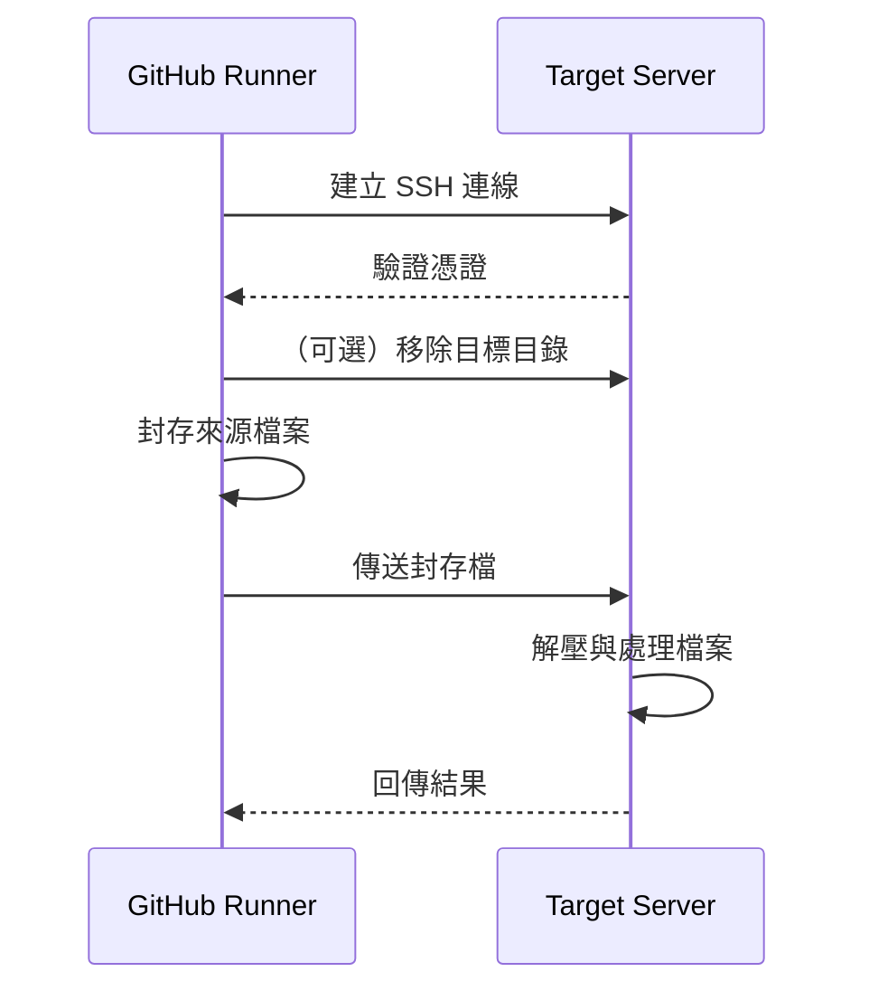

# 🚀 GitHub Actions 的 SCP

[English](README.md) | [简体中文](README.zh-cn.md)

[GitHub Action](https://github.com/features/actions) 用於透過 SSH 複製檔案與產物。

[](https://github.com/appleboy/scp-action/actions/workflows/stable.yml)
[](https://github.com/appleboy/scp-action/actions/workflows/testing.yml)

> **注意：** 只支援 **Linux** [docker](https://www.docker.com/) 容器。

---

## ✨ 功能特色

- ✅ 透過 SSH 將檔案與產物複製到一台或多台遠端伺服器
- ✅ 支援 SSH 金鑰與密碼驗證
- ✅ 完整支援 SSH Proxy（跳板機）
- ✅ 處理 Linux ↔ Windows 路徑轉換
- ✅ 整合 GitHub Artifacts 工作流程
- ✅ 支援增量與差異檔案傳輸
- ✅ 豐富的進階設定選項

---

## 📦 目錄

- [🚀 GitHub Actions 的 SCP](#-github-actions-的-scp)
  - [✨ 功能特色](#-功能特色)
  - [📦 目錄](#-目錄)
  - [🚀 快速開始](#-快速開始)
  - [⚙️ 設定說明](#️-設定說明)
    - [🔌 連線設定](#-連線設定)
    - [📁 檔案傳輸設定](#-檔案傳輸設定)
    - [🌐 Proxy 設定](#-proxy-設定)
  - [🛡️ 最佳實踐與安全性](#️-最佳實踐與安全性)
  - [🖥️ 跨平台注意事項](#️-跨平台注意事項)
  - [💡 使用範例](#-使用範例)
    - [🧩 情境導覽](#-情境導覽)
      - [範例 1：基本 SSH 密碼](#範例-1基本-ssh-密碼)
      - [範例 2：多台伺服器](#範例-2多台伺服器)
      - [範例 3：僅傳送變更檔案](#範例-3僅傳送變更檔案)
      - [範例 4：整合 Artifacts](#範例-4整合-artifacts)
      - [範例 5：Windows 伺服器](#範例-5windows-伺服器)
  - [🗝️ SSH 金鑰設定](#️-ssh-金鑰設定)
  - [🧰 常見錯誤代碼](#-常見錯誤代碼)
  - [🔄 工作流程圖](#-工作流程圖)
  - [FAQ 與疑難排解](#faq-與疑難排解)
  - [📝 授權條款](#-授權條款)

---

## 🚀 快速開始

在 GitHub Actions 工作流程中透過 SSH 複製檔案與產物：

```yaml
name: scp files
on: [push]
jobs:
  build:
    runs-on: ubuntu-latest
    steps:
      - uses: actions/checkout@v4
      - name: 透過 SSH 複製檔案
        uses: appleboy/scp-action@v1
        with:
          host: ${{ secrets.HOST }}
          username: ${{ secrets.USERNAME }}
          password: ${{ secrets.PASSWORD }}
          port: ${{ secrets.PORT }}
          source: "tests/a.txt,tests/b.txt"
          target: your_server_target_folder_path
```

---

## ⚙️ 設定說明

### 🔌 連線設定

| 變數            | 說明                                 | 預設值 | 必填 |
| --------------- | ------------------------------------ | ------ | ---- |
| host            | 遠端主機（多台以逗號分隔）           | -      | ✓    |
| port            | SSH 連接埠                           | 22     |      |
| username        | SSH 使用者名稱                       | -      | ✓    |
| password        | SSH 密碼（建議使用金鑰以提升安全性） | -      |      |
| key             | SSH 私鑰內容                         | -      |      |
| key_path        | SSH 私鑰檔案路徑                     | -      |      |
| passphrase      | SSH 私鑰密碼                         | -      |      |
| fingerprint     | 主機金鑰 SHA256 指紋驗證             | -      |      |
| protocol        | IP 協定：'tcp'、'tcp4' 或 'tcp6'     | tcp    |      |
| timeout         | SSH 連線逾時                         | 30s    |      |
| command_timeout | SCP 指令逾時                         | 10m    |      |

### 📁 檔案傳輸設定

| 變數             | 說明                              | 預設值 | 安全性說明     |
| ---------------- | --------------------------------- | ------ | -------------- |
| source           | 本地要傳送的檔案/目錄（逗號分隔） | -      | 請使用明確路徑 |
| target           | 遠端目標目錄（必須為目錄）        | -      | 避免使用根目錄 |
| rm               | 上傳前移除目標目錄                | -      | 請小心使用     |
| strip_components | 傳送時移除前置路徑元素            | -      |                |
| overwrite        | 使用 tar 覆蓋現有檔案             | -      |                |
| tar_dereference  | tar 傳送時跟隨符號連結            | -      |                |
| tar_tmp_path     | 目標端 tar 暫存檔路徑             | -      |                |
| tar_exec         | 目標端 tar 執行檔路徑             | tar    |                |
| debug            | 啟用除錯輸出                      | -      |                |
| curl_insecure    | curl 使用 --insecure              | false  | 不建議         |
| capture_stdout   | 將指令 stdout 作為 action 輸出    | false  |                |
| version          | 指定 drone-scp 版本               | -      |                |

### 🌐 Proxy 設定

| 變數                      | 說明                            | 預設值 | 必填 |
| ------------------------- | ------------------------------- | ------ | ---- |
| proxy_host                | SSH Proxy 主機                  | -      |      |
| proxy_port                | SSH Proxy 連接埠                | 22     |      |
| proxy_username            | SSH Proxy 使用者名稱            | -      |      |
| proxy_password            | SSH Proxy 密碼                  | -      |      |
| proxy_key                 | SSH Proxy 私鑰內容              | -      |      |
| proxy_key_path            | SSH Proxy 私鑰檔案路徑          | -      |      |
| proxy_passphrase          | SSH Proxy 私鑰密碼              | -      |      |
| proxy_fingerprint         | Proxy 主機 SHA256 指紋驗證      | -      |      |
| proxy_use_insecure_cipher | 啟用較不安全的 Proxy 加密演算法 | -      |      |
| proxy_timeout             | SSH Proxy 連線逾時              | 30s    |      |

---

## 🛡️ 最佳實踐與安全性

- **建議優先使用 SSH 金鑰驗證**，提升安全性。
- 將所有敏感資訊（host、username、password、key）存放於 **GitHub Secrets**。
- 定期**更換部署金鑰**（建議每 90 天一次）。
- 限制目標伺服器目錄的寫入權限。
- 啟用主機金鑰指紋驗證以防止中間人攻擊。
- 避免使用 root 帳號登入 SSH。

---

## 🖥️ 跨平台注意事項

| 情境     | Linux 伺服器   | Windows 伺服器          |
| -------- | -------------- | ----------------------- |
| 路徑格式 | `/path/to/dir` | `/c/path/to/dir`        |
| 必要設定 | 無             | `tar_dereference: true` |
| 權限     | 保留           | 可能需手動設定 ACL      |
| Shell    | bash (預設)    | Git Bash（OpenSSH）     |

> 🚩 **重要提醒：**  
> 複製到 Windows 伺服器時：
>
> - 安裝 Git for Windows 並將 OpenSSH 預設 shell 設為 Git Bash
> - 使用 Unix 風格目標路徑（如 `/c/Users/...`）
> - 啟用 `tar_dereference` 處理符號連結

---

## 💡 使用範例

### 🧩 情境導覽

- **基本檔案傳輸** → [範例 1](#範例-1基本-ssh-密碼)
- **多台伺服器部署** → [範例 2](#範例-2多台伺服器)
- **僅傳送變更檔案** → [範例 3](#範例-3僅傳送變更檔案)
- **整合 Artifacts** → [範例 4](#範例-4整合-artifacts)
- **Windows 伺服器設定** → [範例 5](#範例-5windows-伺服器)

---

#### 範例 1：基本 SSH 密碼

```yaml
- name: 透過 SSH 密碼複製檔案
  uses: appleboy/scp-action@v1
  with:
    host: example.com
    username: foo
    password: bar
    port: 22
    source: "tests/a.txt,tests/b.txt"
    target: your_server_target_folder_path
```

#### 範例 2：多台伺服器

```yaml
- name: 複製到多台伺服器
  uses: appleboy/scp-action@v1
  with:
    host: "foo.com,bar.com"
    username: foo
    password: bar
    port: 22
    source: "tests/a.txt,tests/b.txt"
    target: your_server_target_folder_path
```

#### 範例 3：僅傳送變更檔案

```yaml
- name: 取得變更檔案
  id: changed-files
  uses: tj-actions/changed-files@v35
  with:
    since_last_remote_commit: true
    separator: ","

- name: 複製變更檔案到伺服器
  uses: appleboy/scp-action@v1
  with:
    host: ${{ secrets.HOST }}
    username: ${{ secrets.USERNAME }}
    key: ${{ secrets.KEY }}
    port: ${{ secrets.PORT }}
    source: ${{ steps.changed-files.outputs.all_changed_files }}
    target: your_server_target_folder_path
```

#### 範例 4：整合 Artifacts

```yaml
- uses: actions/upload-artifact@v4
  with:
    name: my-artifact
    path: world.txt

- uses: actions/download-artifact@v4
  with:
    name: my-artifact
    path: distfiles

- name: 複製 artifact 到伺服器
  uses: appleboy/scp-action@v1
  with:
    host: ${{ secrets.HOST }}
    username: ${{ secrets.USERNAME }}
    key: ${{ secrets.KEY }}
    port: ${{ secrets.PORT }}
    source: distfiles/*
    target: your_server_target_folder_path
```

#### 範例 5：Windows 伺服器

```yaml
- name: 複製到 Windows
  uses: appleboy/scp-action@v1
  with:
    host: ${{ secrets.HOST }}
    username: ${{ secrets.USERNAME }}
    key: ${{ secrets.SSH_PRIVATE_KEY }}
    port: 22
    source: "your_source_path"
    target: "/c/path/to/target/"
    tar_dereference: true
    rm: true
```

---

## 🗝️ SSH 金鑰設定

1. **產生 SSH 金鑰**（於本地端執行）：

   ```bash
   # RSA
   ssh-keygen -t rsa -b 4096 -C "your_email@example.com"
   # ED25519
   ssh-keygen -t ed25519 -a 200 -C "your_email@example.com"
   ```

2. **將公鑰加入伺服器**：

   ```bash
   cat .ssh/id_rsa.pub | ssh user@host 'cat >> .ssh/authorized_keys'
   # 或 ed25519
   cat .ssh/id_ed25519.pub | ssh user@host 'cat >> .ssh/authorized_keys'
   ```

3. **將私鑰內容複製到 GitHub Secrets**：

   ```bash
   clip < ~/.ssh/id_rsa
   # 或
   clip < ~/.ssh/id_ed25519
   ```

> 更多細節請參考 [SSH 無密碼登入](http://www.linuxproblem.org/art_9.html)。

**OpenSSH 注意事項：**  
若出現 `ssh: handshake failed: ssh: unable to authenticate, attempted methods [none publickey]`，請確認金鑰演算法支援。  
Ubuntu 20.04+ 可於 `/etc/ssh/sshd_config` 或 `/etc/ssh/sshd_config.d/` 加入：

```sh
CASignatureAlgorithms +ssh-rsa
```

或改用 ed25519 金鑰（預設支援）。

---

## 🧰 常見錯誤代碼

| 錯誤代碼       | 可能原因              | 解決方式                          |
| -------------- | --------------------- | --------------------------------- |
| `ECONNREFUSED` | 連接埠錯誤/防火牆阻擋 | 檢查連接埠與防火牆設定            |
| `ENOENT`       | 找不到來源檔案        | 請用絕對路徑或檢查 checkout 步驟  |
| `EAUTH`        | 驗證失敗              | 檢查金鑰格式與權限（需 PEM 格式） |

---

## 🔄 工作流程圖



---

## FAQ 與疑難排解

- **Q: 為什麼驗證失敗？**  
  A: 請檢查 SSH 金鑰格式、權限，以及金鑰是否已加入伺服器。

- **Q: 如何只複製變更檔案？**  
  A: 使用 `tj-actions/changed-files` 取得變更檔案並傳給 `source`。

- **Q: 如何部署到多台伺服器？**  
  A: `host` 參數用逗號分隔多台主機，例如：`host: "foo.com,bar.com"`

- **Q: 如何複製到 Windows？**  
  A: 設定 Git Bash，使用 Unix 風格路徑，並啟用 `tar_dereference`。

---

## 📝 授權條款

MIT License
